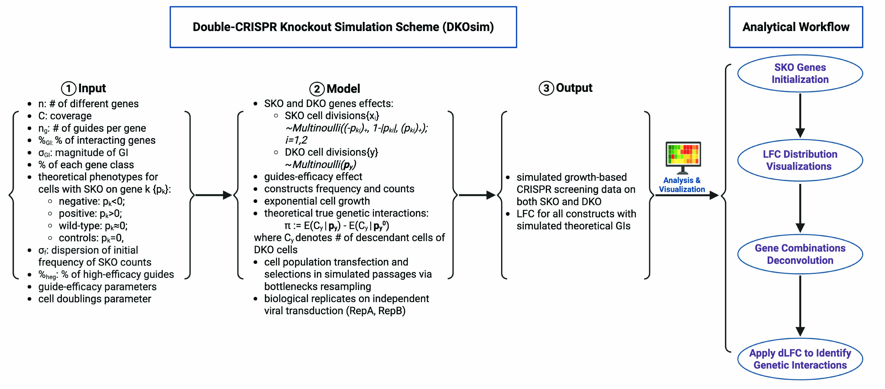

# DKOsimR (Double-CRISPR Knockout Simulation in R)
## Description
DKOsimR is an R package for running Double-CRISPR Knockout Simulation (DKOsim). DKOsim is a simulation framework designed to simulate growth-based dual knockout CRISPR screens. It allows users and investigators to efficiently reproduce synthetic data where both the single gene fitness effect and the interaction of gene pairs can be pre-specified.

## Installation
DKOsimR is an open-source R package. A first step is to download R or RStudio and start an R session. To install DKOsimR and all required dependencies via Github, you may use the following commands in R:

```r
if(!requireNamespace("devtools", quietly = TRUE))
  install.packages("devtools")
devtools::install_github("yuegu-phd/DKOsimR")
devtools::install(dependencies = TRUE)
```

## Getting Started
Load the package and explore its tutorial documents in vignette

```r
library(DKOsimR)
devtools::install(build_vignettes = TRUE)
vignette("DKOsimR") # see tutorial on how to generate synthetic CRISPR data using DKOsimR
browseVignettes("DKOsimR") # see the source code in tutorial
```

It might take a few minutes to build vignette. Alternatively, you may view the pre-built vignette file after installing the package.

```r
DKOsimR::open_dkosim_vignette_pdf()
```

## Overview of Study Design
Primary components of input, model, and output are described here:


Created in BioRender. Gu, Y. (2026) https://BioRender.com/fek72q6

## Example Workflow
After loading DKOsimR, to run a simulation with default parameters, you may simply use

```r
dkosim(sample_name="test", n=40) # adjust sample_name and n to name run and initialize number of genes
```

or in lab approximating mode
```r
dkosim_lab(sample_name="test_lab", n=40)
```

All tunable parameters may be adjusted as desired in both mode. For example,

```r
dkosim(sample_name="test",
       coverage=10,
       n=60,
       n_guide_g=2,
       sd_freq0 = 1/3.29,
       moi = 0.3,
       p_gi=0.03,
       sd_gi=1.5,
       p_high=1,
       mode="CRISPRn-100%Eff",
       pt_neg=0.15,
       pt_pos=0.05,
       pt_wt=0.75,
       pt_ctrl=0.05,
       mu_neg=-0.75,
       sd_neg=0.1,
       mu_pos=0.75,
       sd_pos=0.1,
       sd_wt=0.25,
       size.bottleneck = 2,
       n.bottlenecks= 1,
       n.iterations = 30,
       rseed = 111,
       path = ".")
```

Check vignettes and reference article on more details.


## References
- Gu, Y., Hart, T., Leon-Novelo, L., Shen, J.P.. Double-CRISPR Knockout Simulation (DKOsim): A Monte-Carlo Randomization System to Model Cell Growth Behavior and Infer the Optimal Library Design for Growth-Based Double Knockout Screens. bioRxiv 2025.09.11.675497. DOI: 10.1101/2025.09.11.675497.
- Shen, J., Zhao, D., Sasik, R. et al. Combinatorial CRISPR–Cas9 screens for de novo mapping of genetic interactions. Nat Methods 14, 573–576 (2017). DOI: 10.1038/nmeth.4225.
